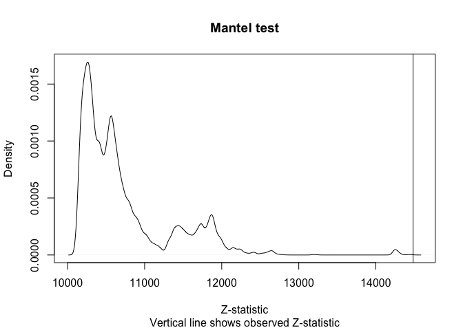
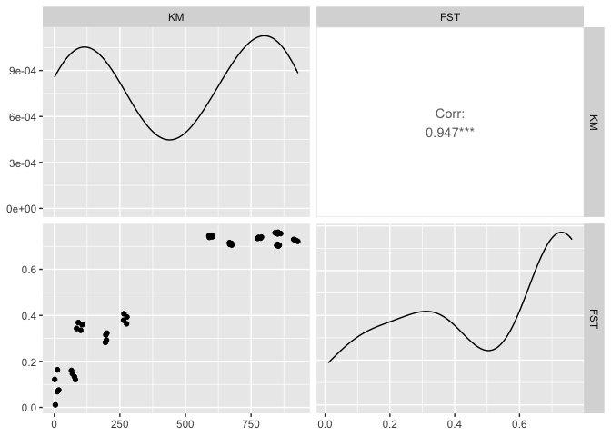
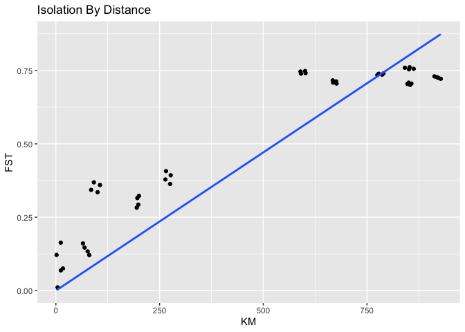

Isolation By Distance
================
Tyler McCraney
2022-05-17

``` r
library(tidyverse)
library(GGally)
library(geosphere)
library(ape)

setwd(dir = "~/twg/IsolationByDistance/")

mtx <- read.csv(file = "Tidewater_goby_samples-pops_sequenced.csv", row.names = "Sample")

# remove temporal samples
mtx <- filter(.data = mtx, !Year %in% c(2006,2009))

# prepare matrix
mtx <- as.matrix(x = mtx[,4:5], rownames.force = T)

mtx
```

                Longitude Latitude
    2011Tillas  -124.1908  41.9335
    2011Earl    -124.2213  41.8279
    2021Stone   -124.1025  41.2468
    2021Big     -124.1127  41.2108
    2021Virgin  -123.8033  39.4716
    2021Pudding -123.8074  39.4576
    2017Antonio -120.6207  34.7964
    2017Ynez    -120.6008  34.6919
    2014Paredon -119.5583  34.4133
    2014Burro   -119.7430  34.4030

``` r
# tabulate geographic distance and FST estimates
dot <- 
  tibble(
    pair = c(
      "2011Tillas-2011Tillas",
      "2011Tillas-2011Earl",
      "2011Tillas-2021Stone",
      "2011Tillas-2021Big",
      "2011Tillas-2021Virgin",
      "2011Tillas-2021Pudding",
      "2011Tillas-2017Antonio",
      "2011Tillas-2017Ynez",
      "2011Tillas-2014Paredon",
      "2011Tillas-2014Burro",
      "2011Tillas-2011Earl",
      "2011Earl-2011Earl",
      "2011Earl-2021Stone",
      "2011Earl-2021Big",
      "2011Earl-2021Virgin",
      "2011Earl-2021Pudding",
      "2011Earl-2017Antonio",
      "2011Earl-2017Ynez",
      "2011Earl-2014Paredon",
      "2011Earl-2014Burro",
      "2011Tillas-2021Stone",
      "2011Earl-2021Stone",
      "2021Stone-2021Stone",
      "2021Stone-2021Big",
      "2021Stone-2021Virgin",
      "2021Stone-2021Pudding",
      "2021Stone-2017Antonio",
      "2021Stone-2017Ynez",
      "2021Stone-2014Paredon",
      "2021Stone-2014Burro",
      "2011Tillas-2021Big",
      "2011Earl-2021Big",
      "2021Stone-2021Big",
      "2021Big-2021Big",
      "2021Big-2021Virgin",
      "2021Big-2021Pudding",
      "2021Big-2017Antonio",
      "2021Big-2017Ynez",
      "2021Big-2014Paredon",
      "2021Big-2014Burro",
      "2011Tillas-2021Virgin",
      "2011Earl-2021Virgin",
      "2021Stone-2021Virgin",
      "2021Big-2021Virgin",
      "2021Virgin-2021Virgin",
      "2021Virgin-2021Pudding",
      "2021Virgin-2017Antonio",
      "2021Virgin-2017Ynez",
      "2021Virgin-2014Paredon",
      "2021Virgin-2014Burro",
      "2011Tillas-2021Pudding",
      "2011Earl-2021Pudding",
      "2021Stone-2021Pudding",
      "2021Big-2021Pudding",
      "2021Virgin-2021Pudding",
      "2021Pudding-2021Pudding",
      "2021Pudding-2017Antonio",
      "2021Pudding-2017Ynez",
      "2021Pudding-2014Paredon",
      "2021Pudding-2014Burro",
      "2011Tillas-2017Antonio",
      "2011Earl-2017Antonio",
      "2021Stone-2017Antonio",
      "2021Big-2017Antonio",
      "2021Virgin-2017Antonio",
      "2021Pudding-2017Antonio",
      "2017Antonio-2017Antonio",
      "2017Antonio-2017Ynez",
      "2017Antonio-2014Paredon",
      "2017Antonio-2014Burro",
      "2011Tillas-2017Ynez",
      "2011Earl-2017Ynez",
      "2021Stone-2017Ynez",
      "2021Big-2017Ynez",
      "2021Virgin-2017Ynez",
      "2021Pudding-2017Ynez",
      "2017Antonio-2017Ynez",
      "2017Ynez-2017Ynez",
      "2017Ynez-2014Paredon",
      "2017Ynez-2014Burro",
      "2011Tillas-2014Paredon",
      "2011Earl-2014Paredon",
      "2021Stone-2014Paredon",
      "2021Big-2014Paredon",
      "2021Virgin-2014Paredon",
      "2021Pudding-2014Paredon",
      "2017Antonio-2014Paredon",
      "2017Ynez-2014Paredon",
      "2014Paredon-2014Paredon",
      "2014Paredon-2014Burro",
      "2011Tillas-2014Burro",
      "2011Earl-2014Burro",
      "2021Stone-2014Burro",
      "2021Big-2014Burro",
      "2021Virgin-2014Burro",
      "2021Pudding-2014Burro",
      "2017Antonio-2014Burro",
      "2017Ynez-2014Burro",
      "2014Paredon-2014Burro",
      "2014Burro-2014Burro"),
    KM = c(
      distVincentyEllipsoid(p1 = mtx["2011Tillas",], p2 = mtx["2011Tillas",])/1000,
      distVincentyEllipsoid(p1 = mtx["2011Tillas",], p2 = mtx["2011Earl",])/1000,
      distVincentyEllipsoid(p1 = mtx["2011Tillas",], p2 = mtx["2021Stone",])/1000,
      distVincentyEllipsoid(p1 = mtx["2011Tillas",], p2 = mtx["2021Big",])/1000,
      distVincentyEllipsoid(p1 = mtx["2011Tillas",], p2 = mtx["2021Virgin",])/1000,
      distVincentyEllipsoid(p1 = mtx["2011Tillas",], p2 = mtx["2021Pudding",])/1000,
      distVincentyEllipsoid(p1 = mtx["2011Tillas",], p2 = mtx["2017Antonio",])/1000,
      distVincentyEllipsoid(p1 = mtx["2011Tillas",], p2 = mtx["2017Ynez",])/1000,
      distVincentyEllipsoid(p1 = mtx["2011Tillas",], p2 = mtx["2014Paredon",])/1000,
      distVincentyEllipsoid(p1 = mtx["2011Tillas",], p2 = mtx["2014Burro",])/1000,
      distVincentyEllipsoid(p1 = mtx["2011Tillas",], p2 = mtx["2011Earl",])/1000,
      distVincentyEllipsoid(p1 = mtx["2011Earl",], p2 = mtx["2011Earl",])/1000,
      distVincentyEllipsoid(p1 = mtx["2011Earl",], p2 = mtx["2021Stone",])/1000,
      distVincentyEllipsoid(p1 = mtx["2011Earl",], p2 = mtx["2021Big",])/1000,
      distVincentyEllipsoid(p1 = mtx["2011Earl",], p2 = mtx["2021Virgin",])/1000,
      distVincentyEllipsoid(p1 = mtx["2011Earl",], p2 = mtx["2021Pudding",])/1000,
      distVincentyEllipsoid(p1 = mtx["2011Earl",], p2 = mtx["2017Antonio",])/1000,
      distVincentyEllipsoid(p1 = mtx["2011Earl",], p2 = mtx["2017Ynez",])/1000,
      distVincentyEllipsoid(p1 = mtx["2011Earl",], p2 = mtx["2014Paredon",])/1000,
      distVincentyEllipsoid(p1 = mtx["2011Earl",], p2 = mtx["2014Burro",])/1000,
      distVincentyEllipsoid(p1 = mtx["2011Tillas",], p2 = mtx["2021Stone",])/1000,
      distVincentyEllipsoid(p1 = mtx["2011Earl",], p2 = mtx["2021Stone",])/1000,
      distVincentyEllipsoid(p1 = mtx["2021Stone",], p2 = mtx["2021Stone",])/1000,
      distVincentyEllipsoid(p1 = mtx["2021Stone",], p2 = mtx["2021Big",])/1000,
      distVincentyEllipsoid(p1 = mtx["2021Stone",], p2 = mtx["2021Virgin",])/1000,
      distVincentyEllipsoid(p1 = mtx["2021Stone",], p2 = mtx["2021Pudding",])/1000,
      distVincentyEllipsoid(p1 = mtx["2021Stone",], p2 = mtx["2017Antonio",])/1000,
      distVincentyEllipsoid(p1 = mtx["2021Stone",], p2 = mtx["2017Ynez",])/1000,
      distVincentyEllipsoid(p1 = mtx["2021Stone",], p2 = mtx["2014Paredon",])/1000,
      distVincentyEllipsoid(p1 = mtx["2021Stone",], p2 = mtx["2014Burro",])/1000,
      distVincentyEllipsoid(p1 = mtx["2011Tillas",], p2 = mtx["2021Big",])/1000,
      distVincentyEllipsoid(p1 = mtx["2011Earl",], p2 = mtx["2021Big",])/1000,
      distVincentyEllipsoid(p1 = mtx["2021Stone",], p2 = mtx["2021Big",])/1000,
      distVincentyEllipsoid(p1 = mtx["2021Big",], p2 = mtx["2021Big",])/1000,
      distVincentyEllipsoid(p1 = mtx["2021Big",], p2 = mtx["2021Virgin",])/1000,
      distVincentyEllipsoid(p1 = mtx["2021Big",], p2 = mtx["2021Pudding",])/1000,
      distVincentyEllipsoid(p1 = mtx["2021Big",], p2 = mtx["2017Antonio",])/1000,
      distVincentyEllipsoid(p1 = mtx["2021Big",], p2 = mtx["2017Ynez",])/1000,
      distVincentyEllipsoid(p1 = mtx["2021Big",], p2 = mtx["2014Paredon",])/1000,
      distVincentyEllipsoid(p1 = mtx["2021Big",], p2 = mtx["2014Burro",])/1000,
      distVincentyEllipsoid(p1 = mtx["2011Tillas",], p2 = mtx["2021Virgin",])/1000,
      distVincentyEllipsoid(p1 = mtx["2011Earl",], p2 = mtx["2021Virgin",])/1000,
      distVincentyEllipsoid(p1 = mtx["2021Stone",], p2 = mtx["2021Virgin",])/1000,
      distVincentyEllipsoid(p1 = mtx["2021Big",], p2 = mtx["2021Virgin",])/1000,
      distVincentyEllipsoid(p1 = mtx["2021Virgin",], p2 = mtx["2021Virgin",])/1000,
      distVincentyEllipsoid(p1 = mtx["2021Virgin",], p2 = mtx["2021Pudding",])/1000,
      distVincentyEllipsoid(p1 = mtx["2021Virgin",], p2 = mtx["2017Antonio",])/1000,
      distVincentyEllipsoid(p1 = mtx["2021Virgin",], p2 = mtx["2017Ynez",])/1000,
      distVincentyEllipsoid(p1 = mtx["2021Virgin",], p2 = mtx["2014Paredon",])/1000,
      distVincentyEllipsoid(p1 = mtx["2021Virgin",], p2 = mtx["2014Burro",])/1000,
      distVincentyEllipsoid(p1 = mtx["2011Tillas",], p2 = mtx["2021Pudding",])/1000,
      distVincentyEllipsoid(p1 = mtx["2011Earl",], p2 = mtx["2021Pudding",])/1000,
      distVincentyEllipsoid(p1 = mtx["2021Stone",], p2 = mtx["2021Pudding",])/1000,
      distVincentyEllipsoid(p1 = mtx["2021Big",], p2 = mtx["2021Pudding",])/1000,
      distVincentyEllipsoid(p1 = mtx["2021Virgin",], p2 = mtx["2021Pudding",])/1000,
      distVincentyEllipsoid(p1 = mtx["2021Pudding",], p2 = mtx["2021Pudding",])/1000,
      distVincentyEllipsoid(p1 = mtx["2021Pudding",], p2 = mtx["2017Antonio",])/1000,
      distVincentyEllipsoid(p1 = mtx["2021Pudding",], p2 = mtx["2017Ynez",])/1000,
      distVincentyEllipsoid(p1 = mtx["2021Pudding",], p2 = mtx["2014Paredon",])/1000,
      distVincentyEllipsoid(p1 = mtx["2021Pudding",], p2 = mtx["2014Burro",])/1000,
      distVincentyEllipsoid(p1 = mtx["2011Tillas",], p2 = mtx["2017Antonio",])/1000,
      distVincentyEllipsoid(p1 = mtx["2011Earl",], p2 = mtx["2017Antonio",])/1000,
      distVincentyEllipsoid(p1 = mtx["2021Stone",], p2 = mtx["2017Antonio",])/1000,
      distVincentyEllipsoid(p1 = mtx["2021Big",], p2 = mtx["2017Antonio",])/1000,
      distVincentyEllipsoid(p1 = mtx["2021Virgin",], p2 = mtx["2017Antonio",])/1000,
      distVincentyEllipsoid(p1 = mtx["2021Pudding",], p2 = mtx["2017Antonio",])/1000,
      distVincentyEllipsoid(p1 = mtx["2017Antonio",], p2 = mtx["2017Antonio",])/1000,
      distVincentyEllipsoid(p1 = mtx["2017Antonio",], p2 = mtx["2017Ynez",])/1000,
      distVincentyEllipsoid(p1 = mtx["2017Antonio",], p2 = mtx["2014Paredon",])/1000,
      distVincentyEllipsoid(p1 = mtx["2017Antonio",], p2 = mtx["2014Burro",])/1000,
      distVincentyEllipsoid(p1 = mtx["2011Tillas",], p2 = mtx["2017Ynez",])/1000,
      distVincentyEllipsoid(p1 = mtx["2011Earl",], p2 = mtx["2017Ynez",])/1000,
      distVincentyEllipsoid(p1 = mtx["2021Stone",], p2 = mtx["2017Ynez",])/1000,
      distVincentyEllipsoid(p1 = mtx["2021Big",], p2 = mtx["2017Ynez",])/1000,
      distVincentyEllipsoid(p1 = mtx["2021Virgin",], p2 = mtx["2017Ynez",])/1000,
      distVincentyEllipsoid(p1 = mtx["2021Pudding",], p2 = mtx["2017Ynez",])/1000,
      distVincentyEllipsoid(p1 = mtx["2017Antonio",], p2 = mtx["2017Ynez",])/1000,
      distVincentyEllipsoid(p1 = mtx["2017Ynez",], p2 = mtx["2017Ynez",])/1000,
      distVincentyEllipsoid(p1 = mtx["2017Ynez",], p2 = mtx["2014Paredon",])/1000,
      distVincentyEllipsoid(p1 = mtx["2017Ynez",], p2 = mtx["2014Burro",])/1000,
      distVincentyEllipsoid(p1 = mtx["2011Tillas",], p2 = mtx["2014Paredon",])/1000,
      distVincentyEllipsoid(p1 = mtx["2011Earl",], p2 = mtx["2014Paredon",])/1000,
      distVincentyEllipsoid(p1 = mtx["2021Stone",], p2 = mtx["2014Paredon",])/1000,
      distVincentyEllipsoid(p1 = mtx["2021Big",], p2 = mtx["2014Paredon",])/1000,
      distVincentyEllipsoid(p1 = mtx["2021Virgin",], p2 = mtx["2014Paredon",])/1000,
      distVincentyEllipsoid(p1 = mtx["2021Pudding",], p2 = mtx["2014Paredon",])/1000,
      distVincentyEllipsoid(p1 = mtx["2017Antonio",], p2 = mtx["2014Paredon",])/1000,
      distVincentyEllipsoid(p1 = mtx["2017Ynez",], p2 = mtx["2014Paredon",])/1000,
      distVincentyEllipsoid(p1 = mtx["2014Paredon",], p2 = mtx["2014Paredon",])/1000,
      distVincentyEllipsoid(p1 = mtx["2014Paredon",], p2 = mtx["2014Burro",])/1000,
      distVincentyEllipsoid(p1 = mtx["2011Tillas",], p2 = mtx["2014Burro",])/1000,
      distVincentyEllipsoid(p1 = mtx["2011Earl",], p2 = mtx["2014Burro",])/1000,
      distVincentyEllipsoid(p1 = mtx["2021Stone",], p2 = mtx["2014Burro",])/1000,
      distVincentyEllipsoid(p1 = mtx["2021Big",], p2 = mtx["2014Burro",])/1000,
      distVincentyEllipsoid(p1 = mtx["2021Virgin",], p2 = mtx["2014Burro",])/1000,
      distVincentyEllipsoid(p1 = mtx["2021Pudding",], p2 = mtx["2014Burro",])/1000,
      distVincentyEllipsoid(p1 = mtx["2017Antonio",], p2 = mtx["2014Burro",])/1000,
      distVincentyEllipsoid(p1 = mtx["2017Ynez",], p2 = mtx["2014Burro",])/1000,
      distVincentyEllipsoid(p1 = mtx["2014Paredon",], p2 = mtx["2014Burro",])/1000,
      distVincentyEllipsoid(p1 = mtx["2014Burro",], p2 = mtx["2014Burro",])/1000),
    FST = c(
      0,
      read_lines(file = "2011Tillas_vs_2011Earl.log", skip = 34, n_max = 1) %>% str_split(pattern = ": ", simplify = T) %>% .[2] %>% as.numeric(),
      read_lines(file = "2011Tillas_vs_2021Stone.log", skip = 34, n_max = 1) %>% str_split(pattern = ": ", simplify = T) %>% .[2] %>% as.numeric(),
      read_lines(file = "2011Tillas_vs_2021Big.log", skip = 34, n_max = 1) %>% str_split(pattern = ": ", simplify = T) %>% .[2] %>% as.numeric(),
      read_lines(file = "2011Tillas_vs_2021Virgin.log", skip = 34, n_max = 1) %>% str_split(pattern = ": ", simplify = T) %>% .[2] %>% as.numeric(),
      read_lines(file = "2011Tillas_vs_2021Pudding.log", skip = 34, n_max = 1) %>% str_split(pattern = ": ", simplify = T) %>% .[2] %>% as.numeric(),
      read_lines(file = "2011Tillas_vs_2017Antonio.log", skip = 34, n_max = 1) %>% str_split(pattern = ": ", simplify = T) %>% .[2] %>% as.numeric(),
      read_lines(file = "2011Tillas_vs_2017Ynez.log", skip = 34, n_max = 1) %>% str_split(pattern = ": ", simplify = T) %>% .[2] %>% as.numeric(),
      read_lines(file = "2011Tillas_vs_2014Paredon.log", skip = 34, n_max = 1) %>% str_split(pattern = ": ", simplify = T) %>% .[2] %>% as.numeric(),
      read_lines(file = "2011Tillas_vs_2014Burro.log", skip = 34, n_max = 1) %>% str_split(pattern = ": ", simplify = T) %>% .[2] %>% as.numeric(),
      read_lines(file = "2011Tillas_vs_2011Earl.log", skip = 34, n_max = 1) %>% str_split(pattern = ": ", simplify = T) %>% .[2] %>% as.numeric(),
      0,
      read_lines(file = "2011Earl_vs_2021Stone.log", skip = 34, n_max = 1) %>% str_split(pattern = ": ", simplify = T) %>% .[2] %>% as.numeric(),
      read_lines(file = "2011Earl_vs_2021Big.log", skip = 34, n_max = 1) %>% str_split(pattern = ": ", simplify = T) %>% .[2] %>% as.numeric(),
      read_lines(file = "2011Earl_vs_2021Virgin.log", skip = 34, n_max = 1) %>% str_split(pattern = ": ", simplify = T) %>% .[2] %>% as.numeric(),
      read_lines(file = "2011Earl_vs_2021Pudding.log", skip = 34, n_max = 1) %>% str_split(pattern = ": ", simplify = T) %>% .[2] %>% as.numeric(),
      read_lines(file = "2011Earl_vs_2017Antonio.log", skip = 34, n_max = 1) %>% str_split(pattern = ": ", simplify = T) %>% .[2] %>% as.numeric(),
      read_lines(file = "2011Earl_vs_2017Ynez.log", skip = 34, n_max = 1) %>% str_split(pattern = ": ", simplify = T) %>% .[2] %>% as.numeric(),
      read_lines(file = "2011Earl_vs_2014Paredon.log", skip = 34, n_max = 1) %>% str_split(pattern = ": ", simplify = T) %>% .[2] %>% as.numeric(),
      read_lines(file = "2011Earl_vs_2014Burro.log", skip = 34, n_max = 1) %>% str_split(pattern = ": ", simplify = T) %>% .[2] %>% as.numeric(),
      read_lines(file = "2011Tillas_vs_2021Stone.log", skip = 34, n_max = 1) %>% str_split(pattern = ": ", simplify = T) %>% .[2] %>% as.numeric(),
      read_lines(file = "2011Earl_vs_2021Stone.log", skip = 34, n_max = 1) %>% str_split(pattern = ": ", simplify = T) %>% .[2] %>% as.numeric(),
      0,
      read_lines(file = "2021Stone_vs_2021Big.log", skip = 34, n_max = 1) %>% str_split(pattern = ": ", simplify = T) %>% .[2] %>% as.numeric(),
      read_lines(file = "2021Stone_vs_2021Virgin.log", skip = 34, n_max = 1) %>% str_split(pattern = ": ", simplify = T) %>% .[2] %>% as.numeric(),
      read_lines(file = "2021Stone_vs_2021Pudding.log", skip = 34, n_max = 1) %>% str_split(pattern = ": ", simplify = T) %>% .[2] %>% as.numeric(),
      read_lines(file = "2021Stone_vs_2017Antonio.log", skip = 34, n_max = 1) %>% str_split(pattern = ": ", simplify = T) %>% .[2] %>% as.numeric(),
      read_lines(file = "2021Stone_vs_2017Ynez.log", skip = 34, n_max = 1) %>% str_split(pattern = ": ", simplify = T) %>% .[2] %>% as.numeric(),
      read_lines(file = "2021Stone_vs_2014Paredon.log", skip = 34, n_max = 1) %>% str_split(pattern = ": ", simplify = T) %>% .[2] %>% as.numeric(),
      read_lines(file = "2021Stone_vs_2014Burro.log", skip = 34, n_max = 1) %>% str_split(pattern = ": ", simplify = T) %>% .[2] %>% as.numeric(),
      read_lines(file = "2011Tillas_vs_2021Big.log", skip = 34, n_max = 1) %>% str_split(pattern = ": ", simplify = T) %>% .[2] %>% as.numeric(),
      read_lines(file = "2011Earl_vs_2021Big.log", skip = 34, n_max = 1) %>% str_split(pattern = ": ", simplify = T) %>% .[2] %>% as.numeric(),
      read_lines(file = "2021Stone_vs_2021Big.log", skip = 34, n_max = 1) %>% str_split(pattern = ": ", simplify = T) %>% .[2] %>% as.numeric(),
      0,
      read_lines(file = "2021Big_vs_2021Virgin.log", skip = 34, n_max = 1) %>% str_split(pattern = ": ", simplify = T) %>% .[2] %>% as.numeric(),
      read_lines(file = "2021Big_vs_2021Pudding.log", skip = 34, n_max = 1) %>% str_split(pattern = ": ", simplify = T) %>% .[2] %>% as.numeric(),
      read_lines(file = "2021Big_vs_2017Antonio.log", skip = 34, n_max = 1) %>% str_split(pattern = ": ", simplify = T) %>% .[2] %>% as.numeric(),
      read_lines(file = "2021Big_vs_2017Ynez.log", skip = 34, n_max = 1) %>% str_split(pattern = ": ", simplify = T) %>% .[2] %>% as.numeric(),
      read_lines(file = "2021Big_vs_2014Paredon.log", skip = 34, n_max = 1) %>% str_split(pattern = ": ", simplify = T) %>% .[2] %>% as.numeric(),
      read_lines(file = "2021Big_vs_2014Burro.log", skip = 34, n_max = 1) %>% str_split(pattern = ": ", simplify = T) %>% .[2] %>% as.numeric(),
      read_lines(file = "2011Tillas_vs_2021Virgin.log", skip = 34, n_max = 1) %>% str_split(pattern = ": ", simplify = T) %>% .[2] %>% as.numeric(),
      read_lines(file = "2011Earl_vs_2021Virgin.log", skip = 34, n_max = 1) %>% str_split(pattern = ": ", simplify = T) %>% .[2] %>% as.numeric(),
      read_lines(file = "2021Stone_vs_2021Virgin.log", skip = 34, n_max = 1) %>% str_split(pattern = ": ", simplify = T) %>% .[2] %>% as.numeric(),
      read_lines(file = "2021Big_vs_2021Virgin.log", skip = 34, n_max = 1) %>% str_split(pattern = ": ", simplify = T) %>% .[2] %>% as.numeric(),
      0,
      read_lines(file = "2021Virgin_vs_2021Pudding.log", skip = 34, n_max = 1) %>% str_split(pattern = ": ", simplify = T) %>% .[2] %>% as.numeric(),
      read_lines(file = "2021Virgin_vs_2017Antonio.log", skip = 34, n_max = 1) %>% str_split(pattern = ": ", simplify = T) %>% .[2] %>% as.numeric(),
      read_lines(file = "2021Virgin_vs_2017Ynez.log", skip = 34, n_max = 1) %>% str_split(pattern = ": ", simplify = T) %>% .[2] %>% as.numeric(),
      read_lines(file = "2021Virgin_vs_2014Paredon.log", skip = 34, n_max = 1) %>% str_split(pattern = ": ", simplify = T) %>% .[2] %>% as.numeric(),
      read_lines(file = "2021Virgin_vs_2014Burro.log", skip = 34, n_max = 1) %>% str_split(pattern = ": ", simplify = T) %>% .[2] %>% as.numeric(),
      read_lines(file = "2011Tillas_vs_2021Pudding.log", skip = 34, n_max = 1) %>% str_split(pattern = ": ", simplify = T) %>% .[2] %>% as.numeric(),
      read_lines(file = "2011Earl_vs_2021Pudding.log", skip = 34, n_max = 1) %>% str_split(pattern = ": ", simplify = T) %>% .[2] %>% as.numeric(),
      read_lines(file = "2021Stone_vs_2021Pudding.log", skip = 34, n_max = 1) %>% str_split(pattern = ": ", simplify = T) %>% .[2] %>% as.numeric(),
      read_lines(file = "2021Big_vs_2021Pudding.log", skip = 34, n_max = 1) %>% str_split(pattern = ": ", simplify = T) %>% .[2] %>% as.numeric(),
      read_lines(file = "2021Virgin_vs_2021Pudding.log", skip = 34, n_max = 1) %>% str_split(pattern = ": ", simplify = T) %>% .[2] %>% as.numeric(),
      0,
      read_lines(file = "2021Pudding_vs_2017Antonio.log", skip = 34, n_max = 1) %>% str_split(pattern = ": ", simplify = T) %>% .[2] %>% as.numeric(),
      read_lines(file = "2021Pudding_vs_2017Ynez.log", skip = 34, n_max = 1) %>% str_split(pattern = ": ", simplify = T) %>% .[2] %>% as.numeric(),
      read_lines(file = "2021Pudding_vs_2014Paredon.log", skip = 34, n_max = 1) %>% str_split(pattern = ": ", simplify = T) %>% .[2] %>% as.numeric(),
      read_lines(file = "2021Pudding_vs_2014Burro.log", skip = 34, n_max = 1) %>% str_split(pattern = ": ", simplify = T) %>% .[2] %>% as.numeric(),
      read_lines(file = "2011Tillas_vs_2017Antonio.log", skip = 34, n_max = 1) %>% str_split(pattern = ": ", simplify = T) %>% .[2] %>% as.numeric(),
      read_lines(file = "2011Earl_vs_2017Antonio.log", skip = 34, n_max = 1) %>% str_split(pattern = ": ", simplify = T) %>% .[2] %>% as.numeric(),
      read_lines(file = "2021Stone_vs_2017Antonio.log", skip = 34, n_max = 1) %>% str_split(pattern = ": ", simplify = T) %>% .[2] %>% as.numeric(),
      read_lines(file = "2021Big_vs_2017Antonio.log", skip = 34, n_max = 1) %>% str_split(pattern = ": ", simplify = T) %>% .[2] %>% as.numeric(),
      read_lines(file = "2021Virgin_vs_2017Antonio.log", skip = 34, n_max = 1) %>% str_split(pattern = ": ", simplify = T) %>% .[2] %>% as.numeric(),
      read_lines(file = "2021Pudding_vs_2017Antonio.log", skip = 34, n_max = 1) %>% str_split(pattern = ": ", simplify = T) %>% .[2] %>% as.numeric(),
      0,
      read_lines(file = "2017Antonio_vs_2017Ynez.log", skip = 34, n_max = 1) %>% str_split(pattern = ": ", simplify = T) %>% .[2] %>% as.numeric(),
      read_lines(file = "2017Antonio_vs_2014Paredon.log", skip = 34, n_max = 1) %>% str_split(pattern = ": ", simplify = T) %>% .[2] %>% as.numeric(),
      read_lines(file = "2017Antonio_vs_2014Burro.log", skip = 34, n_max = 1) %>% str_split(pattern = ": ", simplify = T) %>% .[2] %>% as.numeric(),
      read_lines(file = "2011Tillas_vs_2017Ynez.log", skip = 34, n_max = 1) %>% str_split(pattern = ": ", simplify = T) %>% .[2] %>% as.numeric(),
      read_lines(file = "2011Earl_vs_2017Ynez.log", skip = 34, n_max = 1) %>% str_split(pattern = ": ", simplify = T) %>% .[2] %>% as.numeric(),
      read_lines(file = "2021Stone_vs_2017Ynez.log", skip = 34, n_max = 1) %>% str_split(pattern = ": ", simplify = T) %>% .[2] %>% as.numeric(),
      read_lines(file = "2021Big_vs_2017Ynez.log", skip = 34, n_max = 1) %>% str_split(pattern = ": ", simplify = T) %>% .[2] %>% as.numeric(),
      read_lines(file = "2021Virgin_vs_2017Ynez.log", skip = 34, n_max = 1) %>% str_split(pattern = ": ", simplify = T) %>% .[2] %>% as.numeric(),
      read_lines(file = "2021Pudding_vs_2017Ynez.log", skip = 34, n_max = 1) %>% str_split(pattern = ": ", simplify = T) %>% .[2] %>% as.numeric(),
      read_lines(file = "2017Antonio_vs_2017Ynez.log", skip = 34, n_max = 1) %>% str_split(pattern = ": ", simplify = T) %>% .[2] %>% as.numeric(),
      0,
      read_lines(file = "2017Ynez_vs_2014Paredon.log", skip = 34, n_max = 1) %>% str_split(pattern = ": ", simplify = T) %>% .[2] %>% as.numeric(),
      read_lines(file = "2017Ynez_vs_2014Burro.log", skip = 34, n_max = 1) %>% str_split(pattern = ": ", simplify = T) %>% .[2] %>% as.numeric(),
      read_lines(file = "2011Tillas_vs_2014Paredon.log", skip = 34, n_max = 1) %>% str_split(pattern = ": ", simplify = T) %>% .[2] %>% as.numeric(),
      read_lines(file = "2011Earl_vs_2014Paredon.log", skip = 34, n_max = 1) %>% str_split(pattern = ": ", simplify = T) %>% .[2] %>% as.numeric(),
      read_lines(file = "2021Stone_vs_2014Paredon.log", skip = 34, n_max = 1) %>% str_split(pattern = ": ", simplify = T) %>% .[2] %>% as.numeric(),
      read_lines(file = "2021Big_vs_2014Paredon.log", skip = 34, n_max = 1) %>% str_split(pattern = ": ", simplify = T) %>% .[2] %>% as.numeric(),
      read_lines(file = "2021Virgin_vs_2014Paredon.log", skip = 34, n_max = 1) %>% str_split(pattern = ": ", simplify = T) %>% .[2] %>% as.numeric(),
      read_lines(file = "2021Pudding_vs_2014Paredon.log", skip = 34, n_max = 1) %>% str_split(pattern = ": ", simplify = T) %>% .[2] %>% as.numeric(),
      read_lines(file = "2017Antonio_vs_2014Paredon.log", skip = 34, n_max = 1) %>% str_split(pattern = ": ", simplify = T) %>% .[2] %>% as.numeric(),
      read_lines(file = "2017Ynez_vs_2014Paredon.log", skip = 34, n_max = 1) %>% str_split(pattern = ": ", simplify = T) %>% .[2] %>% as.numeric(),
      0,
      read_lines(file = "2014Paredon_vs_2014Burro.log", skip = 34, n_max = 1) %>% str_split(pattern = ": ", simplify = T) %>% .[2] %>% as.numeric(),
      read_lines(file = "2011Tillas_vs_2014Burro.log", skip = 34, n_max = 1) %>% str_split(pattern = ": ", simplify = T) %>% .[2] %>% as.numeric(),
      read_lines(file = "2011Earl_vs_2014Burro.log", skip = 34, n_max = 1) %>% str_split(pattern = ": ", simplify = T) %>% .[2] %>% as.numeric(),
      read_lines(file = "2021Stone_vs_2014Burro.log", skip = 34, n_max = 1) %>% str_split(pattern = ": ", simplify = T) %>% .[2] %>% as.numeric(),
      read_lines(file = "2021Big_vs_2014Burro.log", skip = 34, n_max = 1) %>% str_split(pattern = ": ", simplify = T) %>% .[2] %>% as.numeric(),
      read_lines(file = "2021Virgin_vs_2014Burro.log", skip = 34, n_max = 1) %>% str_split(pattern = ": ", simplify = T) %>% .[2] %>% as.numeric(),
      read_lines(file = "2021Pudding_vs_2014Burro.log", skip = 34, n_max = 1) %>% str_split(pattern = ": ", simplify = T) %>% .[2] %>% as.numeric(),
      read_lines(file = "2017Antonio_vs_2014Burro.log", skip = 34, n_max = 1) %>% str_split(pattern = ": ", simplify = T) %>% .[2] %>% as.numeric(),
      read_lines(file = "2017Ynez_vs_2014Burro.log", skip = 34, n_max = 1) %>% str_split(pattern = ": ", simplify = T) %>% .[2] %>% as.numeric(),
      read_lines(file = "2014Paredon_vs_2014Burro.log", skip = 34, n_max = 1) %>% str_split(pattern = ": ", simplify = T) %>% .[2] %>% as.numeric(),
      0))

# Mantel test
km <- matrix(data = dot$KM, nrow = 10, ncol = 10, dimnames = list(rownames(mtx),rownames(mtx)))

fst <- matrix(data = dot$FST, nrow = 10, ncol = 10, dimnames = list(rownames(mtx),rownames(mtx)))

mantel.test(m1 = km, m2 = fst, nperm = 1000000, graph = T, main = "Mantel test", xlab = "Z-statistic", sub = "Vertical line shows observed Z-statistic")
```

<!-- -->

    $z.stat
    [1] 14482.91

    $p
    [1] 3.099997e-05

    $alternative
    [1] "two.sided"

``` r
# filter dups and selfs for plotting
dat <- filter(.data = dot, KM != 0) %>% distinct(pair, .keep_all = T)

# inspect data
ggpairs(dat[,2:3])
```

<!-- -->

``` r
# fit linear model without an intercept term
lm(formula = FST ~ KM - 1, data = dat) %>% summary()
```


    Call:
    lm(formula = FST ~ KM - 1, data = dat)

    Residuals:
         Min       1Q   Median       3Q      Max 
    -0.15196 -0.03304  0.07648  0.13231  0.28265 

    Coefficients:
        Estimate Std. Error t value Pr(>|t|)    
    KM 9.416e-04  3.332e-05   28.26   <2e-16 ***
    ---
    Signif. codes:  0 '***' 0.001 '**' 0.01 '*' 0.05 '.' 0.1 ' ' 1

    Residual standard error: 0.1307 on 44 degrees of freedom
    Multiple R-squared:  0.9478,    Adjusted R-squared:  0.9466 
    F-statistic: 798.5 on 1 and 44 DF,  p-value: < 2.2e-16

``` r
# plot w/ regression line thru origin
ggplot(data = dat, mapping = aes(x = KM, y = FST)) +
  geom_point() +
  geom_smooth(formula = "y ~ x - 1", method = "lm", se = F) +
  labs(title = "Isolation By Distance")
```

<!-- -->
