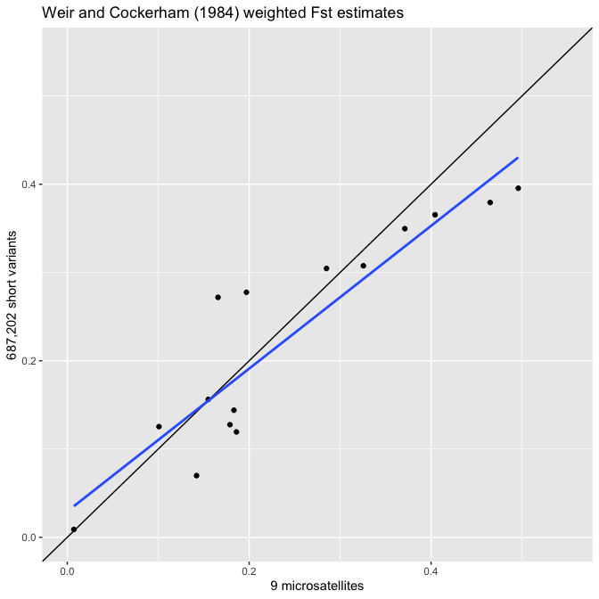

WGS_vs_Kinziger_et_al_2015
================
Tyler McCraney
2022-05-16

Lets see how FST estimates from genome-wide biallelic variants compare
to FST estimates from a handful of microsatellites.

FST estimates based on *n* = 9 microsatellite loci were downloaded from
the SI of Kinziger *et al*. (2015) and tabulated into a CSV. An average
of 50.3 individuals (standard deviation 5) were
microsatellite-genotyped.

Okay now lets estimate pairwise FST with the VCFtools app. We used the
following shell script on a remote IBM server:

``` bash
cat /Users/macrodontogobius/twg/WGS_vs_Kinziger_et_al_2015/vcftools_vs_Kinziger_et_al_2015.sh
```

    ## #!/bin/bash
    ## 
    ## cd /home/instr1/twg/popgen/pops
    ## 
    ## cat 2011Tillas.txt 2011Earl.txt 2006Stone.txt 2006Big.txt 2009Arcata.txt 2006Virgin.txt 2006Pudding.txt > 2006-11.txt 
    ## 
    ## # prepare callset for 2006-2011 samples
    ## # remove all sites with a FILTER flag other than PASS: --remove-filtered-all
    ## # include only sites with a Minor Allele Frequency greater than or equal to 0.05: vcftools --vcf file1.vcf --maf 0.05
    ## # include only bi-allelic sites: vcftools --vcf file1.vcf --min-alleles 2 --max-alleles 2
    ## # exclude sites by the proportion of missing data (between 0 and 1: 0 allows sites that are completely missing; 1 indicates no missing data allowed): --max-missing 0.5
    ## 
    ## vcftools \
    ## --gzvcf /home/instr1/twg/variants/selectvariants.vcf.gz \
    ## --keep /home/instr1/twg/popgen/pops/2006-11.txt \
    ## --remove-filtered-all \
    ## --maf 0.05 \
    ## --min-alleles 2 \
    ## --max-alleles 2 \
    ## --max-missing 0.5 \
    ## --recode \
    ## --out /home/instr1/twg/popgen/pairwise-fst/vs_Kinziger_et_al_2015/2006-11
    ## 
    ## gzip /home/instr1/twg/popgen/pairwise-fst/vs_Kinziger_et_al_2015/2006-11.recode.vcf
    ## 
    ## # pairwise FST
    ## vcftools \
    ## --gzvcf /home/instr1/twg/popgen/pairwise-fst/vs_Kinziger_et_al_2015/2006-11.recode.vcf.gz \
    ## --weir-fst-pop /home/instr1/twg/popgen/pops/2011Tillas.txt \
    ## --weir-fst-pop /home/instr1/twg/popgen/pops/2011Earl.txt \
    ## --out /home/instr1/twg/popgen/pairwise-fst/vs_Kinziger_et_al_2015/2011Tillas_vs_2011Earl
    ## 
    ## vcftools \
    ## --gzvcf /home/instr1/twg/popgen/pairwise-fst/vs_Kinziger_et_al_2015/2006-11.recode.vcf.gz \
    ## --weir-fst-pop /home/instr1/twg/popgen/pops/2011Tillas.txt \
    ## --weir-fst-pop /home/instr1/twg/popgen/pops/2006Stone.txt \
    ## --out /home/instr1/twg/popgen/pairwise-fst/vs_Kinziger_et_al_2015/2011Tillas_vs_2006Stone
    ## 
    ## vcftools \
    ## --gzvcf /home/instr1/twg/popgen/pairwise-fst/vs_Kinziger_et_al_2015/2006-11.recode.vcf.gz \
    ## --weir-fst-pop /home/instr1/twg/popgen/pops/2011Tillas.txt \
    ## --weir-fst-pop /home/instr1/twg/popgen/pops/2006Big.txt \
    ## --out /home/instr1/twg/popgen/pairwise-fst/vs_Kinziger_et_al_2015/2011Tillas_vs_2006Big
    ## 
    ## vcftools \
    ## --gzvcf /home/instr1/twg/popgen/pairwise-fst/vs_Kinziger_et_al_2015/2006-11.recode.vcf.gz \
    ## --weir-fst-pop /home/instr1/twg/popgen/pops/2011Tillas.txt \
    ## --weir-fst-pop /home/instr1/twg/popgen/pops/2009Arcata.txt \
    ## --out /home/instr1/twg/popgen/pairwise-fst/vs_Kinziger_et_al_2015/2011Tillas_vs_2009Arcata
    ## 
    ## vcftools \
    ## --gzvcf /home/instr1/twg/popgen/pairwise-fst/vs_Kinziger_et_al_2015/2006-11.recode.vcf.gz \
    ## --weir-fst-pop /home/instr1/twg/popgen/pops/2011Tillas.txt \
    ## --weir-fst-pop /home/instr1/twg/popgen/pops/2006Virgin.txt \
    ## --out /home/instr1/twg/popgen/pairwise-fst/vs_Kinziger_et_al_2015/2011Tillas_vs_2006Virgin
    ## 
    ## vcftools \
    ## --gzvcf /home/instr1/twg/popgen/pairwise-fst/vs_Kinziger_et_al_2015/2006-11.recode.vcf.gz \
    ## --weir-fst-pop /home/instr1/twg/popgen/pops/2011Tillas.txt \
    ## --weir-fst-pop /home/instr1/twg/popgen/pops/2006Pudding.txt \
    ## --out /home/instr1/twg/popgen/pairwise-fst/vs_Kinziger_et_al_2015/2011Tillas_vs_2006Pudding
    ## 
    ## vcftools \
    ## --gzvcf /home/instr1/twg/popgen/pairwise-fst/vs_Kinziger_et_al_2015/2006-11.recode.vcf.gz \
    ## --weir-fst-pop /home/instr1/twg/popgen/pops/2011Earl.txt \
    ## --weir-fst-pop /home/instr1/twg/popgen/pops/2006Stone.txt \
    ## --out /home/instr1/twg/popgen/pairwise-fst/vs_Kinziger_et_al_2015/2011Earl_vs_2006Stone
    ## 
    ## vcftools \
    ## --gzvcf /home/instr1/twg/popgen/pairwise-fst/vs_Kinziger_et_al_2015/2006-11.recode.vcf.gz \
    ## --weir-fst-pop /home/instr1/twg/popgen/pops/2011Earl.txt \
    ## --weir-fst-pop /home/instr1/twg/popgen/pops/2006Big.txt \
    ## --out /home/instr1/twg/popgen/pairwise-fst/vs_Kinziger_et_al_2015/2011Earl_vs_2006Big
    ## 
    ## vcftools \
    ## --gzvcf /home/instr1/twg/popgen/pairwise-fst/vs_Kinziger_et_al_2015/2006-11.recode.vcf.gz \
    ## --weir-fst-pop /home/instr1/twg/popgen/pops/2011Earl.txt \
    ## --weir-fst-pop /home/instr1/twg/popgen/pops/2009Arcata.txt \
    ## --out /home/instr1/twg/popgen/pairwise-fst/vs_Kinziger_et_al_2015/2011Earl_vs_2009Arcata
    ## 
    ## vcftools \
    ## --gzvcf /home/instr1/twg/popgen/pairwise-fst/vs_Kinziger_et_al_2015/2006-11.recode.vcf.gz \
    ## --weir-fst-pop /home/instr1/twg/popgen/pops/2011Earl.txt \
    ## --weir-fst-pop /home/instr1/twg/popgen/pops/2006Virgin.txt \
    ## --out /home/instr1/twg/popgen/pairwise-fst/vs_Kinziger_et_al_2015/2011Earl_vs_2006Virgin
    ## 
    ## vcftools \
    ## --gzvcf /home/instr1/twg/popgen/pairwise-fst/vs_Kinziger_et_al_2015/2006-11.recode.vcf.gz \
    ## --weir-fst-pop /home/instr1/twg/popgen/pops/2011Earl.txt \
    ## --weir-fst-pop /home/instr1/twg/popgen/pops/2006Pudding.txt \
    ## --out /home/instr1/twg/popgen/pairwise-fst/vs_Kinziger_et_al_2015/2011Earl_vs_2006Pudding
    ## 
    ## vcftools \
    ## --gzvcf /home/instr1/twg/popgen/pairwise-fst/vs_Kinziger_et_al_2015/2006-11.recode.vcf.gz \
    ## --weir-fst-pop /home/instr1/twg/popgen/pops/2006Stone.txt \
    ## --weir-fst-pop /home/instr1/twg/popgen/pops/2006Big.txt \
    ## --out /home/instr1/twg/popgen/pairwise-fst/vs_Kinziger_et_al_2015/2006Stone_vs_2006Big
    ## 
    ## vcftools \
    ## --gzvcf /home/instr1/twg/popgen/pairwise-fst/vs_Kinziger_et_al_2015/2006-11.recode.vcf.gz \
    ## --weir-fst-pop /home/instr1/twg/popgen/pops/2006Stone.txt \
    ## --weir-fst-pop /home/instr1/twg/popgen/pops/2009Arcata.txt \
    ## --out /home/instr1/twg/popgen/pairwise-fst/vs_Kinziger_et_al_2015/2006Stone_vs_2009Arcata
    ## 
    ## vcftools \
    ## --gzvcf /home/instr1/twg/popgen/pairwise-fst/vs_Kinziger_et_al_2015/2006-11.recode.vcf.gz \
    ## --weir-fst-pop /home/instr1/twg/popgen/pops/2006Stone.txt \
    ## --weir-fst-pop /home/instr1/twg/popgen/pops/2006Virgin.txt \
    ## --out /home/instr1/twg/popgen/pairwise-fst/vs_Kinziger_et_al_2015/2006Stone_vs_2006Virgin
    ## 
    ## vcftools \
    ## --gzvcf /home/instr1/twg/popgen/pairwise-fst/vs_Kinziger_et_al_2015/2006-11.recode.vcf.gz \
    ## --weir-fst-pop /home/instr1/twg/popgen/pops/2006Stone.txt \
    ## --weir-fst-pop /home/instr1/twg/popgen/pops/2006Pudding.txt \
    ## --out /home/instr1/twg/popgen/pairwise-fst/vs_Kinziger_et_al_2015/2006Stone_vs_2006Pudding
    ## 
    ## vcftools \
    ## --gzvcf /home/instr1/twg/popgen/pairwise-fst/vs_Kinziger_et_al_2015/2006-11.recode.vcf.gz \
    ## --weir-fst-pop /home/instr1/twg/popgen/pops/2006Big.txt \
    ## --weir-fst-pop /home/instr1/twg/popgen/pops/2009Arcata.txt \
    ## --out /home/instr1/twg/popgen/pairwise-fst/vs_Kinziger_et_al_2015/2006Big_vs_2009Arcata
    ## 
    ## vcftools \
    ## --gzvcf /home/instr1/twg/popgen/pairwise-fst/vs_Kinziger_et_al_2015/2006-11.recode.vcf.gz \
    ## --weir-fst-pop /home/instr1/twg/popgen/pops/2006Big.txt \
    ## --weir-fst-pop /home/instr1/twg/popgen/pops/2006Virgin.txt \
    ## --out /home/instr1/twg/popgen/pairwise-fst/vs_Kinziger_et_al_2015/2006Big_vs_2006Virgin
    ## 
    ## vcftools \
    ## --gzvcf /home/instr1/twg/popgen/pairwise-fst/vs_Kinziger_et_al_2015/2006-11.recode.vcf.gz \
    ## --weir-fst-pop /home/instr1/twg/popgen/pops/2006Big.txt \
    ## --weir-fst-pop /home/instr1/twg/popgen/pops/2006Pudding.txt \
    ## --out /home/instr1/twg/popgen/pairwise-fst/vs_Kinziger_et_al_2015/2006Big_vs_2006Pudding
    ## 
    ## vcftools \
    ## --gzvcf /home/instr1/twg/popgen/pairwise-fst/vs_Kinziger_et_al_2015/2006-11.recode.vcf.gz \
    ## --weir-fst-pop /home/instr1/twg/popgen/pops/2009Arcata.txt \
    ## --weir-fst-pop /home/instr1/twg/popgen/pops/2006Virgin.txt \
    ## --out /home/instr1/twg/popgen/pairwise-fst/vs_Kinziger_et_al_2015/2009Arcata_vs_2006Virgin
    ## 
    ## vcftools \
    ## --gzvcf /home/instr1/twg/popgen/pairwise-fst/vs_Kinziger_et_al_2015/2006-11.recode.vcf.gz \
    ## --weir-fst-pop /home/instr1/twg/popgen/pops/2009Arcata.txt \
    ## --weir-fst-pop /home/instr1/twg/popgen/pops/2006Pudding.txt \
    ## --out /home/instr1/twg/popgen/pairwise-fst/vs_Kinziger_et_al_2015/2009Arcata_vs_2006Pudding
    ## 
    ## vcftools \
    ## --gzvcf /home/instr1/twg/popgen/pairwise-fst/vs_Kinziger_et_al_2015/2006-11.recode.vcf.gz \
    ## --weir-fst-pop /home/instr1/twg/popgen/pops/2006Virgin.txt \
    ## --weir-fst-pop /home/instr1/twg/popgen/pops/2006Pudding.txt \
    ## --out /home/instr1/twg/popgen/pairwise-fst/vs_Kinziger_et_al_2015/2006Virgin_vs_2006Pudding

Our filtered callset contains *n* = 38 individuals and *n* = 687,202
biallelic short variant loci. We refer to these loci as biallelic short
variants because they include both SNPs and INDELs.

Okay lets use `R` to parse the VCFtools log files to extract weighted
FST estimates. Then we’ll join the genome-wide FST estimates with the
microsatellite-based estimates of Kinziger *et al*. (2015).

``` r
library(tidyverse)
library(ggrepel)
library(GGally)

setwd(dir = "~/twg/WGS_vs_Kinziger_et_al_2015/")

WGS <- 
  tibble(
    FST = c(
      "2006Big_vs_2006Pudding",
      "2006Big_vs_2006Virgin",
      "2006Big_vs_2009Arcata",
      "2006Stone_vs_2006Big",
      "2006Stone_vs_2006Pudding",
      "2006Stone_vs_2006Virgin",
      "2006Stone_vs_2009Arcata",
      "2006Virgin_vs_2006Pudding",
      "2009Arcata_vs_2006Pudding",
      "2009Arcata_vs_2006Virgin",
      "2011Earl_vs_2006Big",
      "2011Earl_vs_2006Pudding",
      "2011Earl_vs_2006Stone",
      "2011Earl_vs_2006Virgin",
      "2011Earl_vs_2009Arcata",
      "2011Tillas_vs_2006Big",
      "2011Tillas_vs_2006Pudding",
      "2011Tillas_vs_2006Stone",
      "2011Tillas_vs_2006Virgin",
      "2011Tillas_vs_2009Arcata",
      "2011Tillas_vs_2011Earl"),
    short_variants = c(
      read_lines(file = "2006Big_vs_2006Pudding.log", skip = 34, n_max = 1) %>% str_split(pattern = ": ", simplify = T) %>% .[2] %>% as.numeric(),
      read_lines(file = "2006Big_vs_2006Virgin.log", skip = 34, n_max = 1) %>% str_split(pattern = ": ", simplify = T) %>% .[2] %>% as.numeric(),
      read_lines(file = "2006Big_vs_2009Arcata.log", skip = 34, n_max = 1) %>% str_split(pattern = ": ", simplify = T) %>% .[2] %>% as.numeric(),
      read_lines(file = "2006Stone_vs_2006Big.log", skip = 34, n_max = 1) %>% str_split(pattern = ": ", simplify = T) %>% .[2] %>% as.numeric(),
      read_lines(file = "2006Stone_vs_2006Pudding.log", skip = 34, n_max = 1) %>% str_split(pattern = ": ", simplify = T) %>% .[2] %>% as.numeric(),
      read_lines(file = "2006Stone_vs_2006Virgin.log", skip = 34, n_max = 1) %>% str_split(pattern = ": ", simplify = T) %>% .[2] %>% as.numeric(),
      read_lines(file = "2006Stone_vs_2009Arcata.log", skip = 34, n_max = 1) %>% str_split(pattern = ": ", simplify = T) %>% .[2] %>% as.numeric(),
      read_lines(file = "2006Virgin_vs_2006Pudding.log", skip = 34, n_max = 1) %>% str_split(pattern = ": ", simplify = T) %>% .[2] %>% as.numeric(),
      read_lines(file = "2009Arcata_vs_2006Pudding.log", skip = 34, n_max = 1) %>% str_split(pattern = ": ", simplify = T) %>% .[2] %>% as.numeric(),
      read_lines(file = "2009Arcata_vs_2006Virgin.log", skip = 34, n_max = 1) %>% str_split(pattern = ": ", simplify = T) %>% .[2] %>% as.numeric(),
      read_lines(file = "2011Earl_vs_2006Big.log", skip = 34, n_max = 1) %>% str_split(pattern = ": ", simplify = T) %>% .[2] %>% as.numeric(),
      read_lines(file = "2011Earl_vs_2006Pudding.log", skip = 34, n_max = 1) %>% str_split(pattern = ": ", simplify = T) %>% .[2] %>% as.numeric(),
      read_lines(file = "2011Earl_vs_2006Stone.log", skip = 34, n_max = 1) %>% str_split(pattern = ": ", simplify = T) %>% .[2] %>% as.numeric(),
      read_lines(file = "2011Earl_vs_2006Virgin.log", skip = 34, n_max = 1) %>% str_split(pattern = ": ", simplify = T) %>% .[2] %>% as.numeric(),
      read_lines(file = "2011Earl_vs_2009Arcata.log", skip = 34, n_max = 1) %>% str_split(pattern = ": ", simplify = T) %>% .[2] %>% as.numeric(),
      read_lines(file = "2011Tillas_vs_2006Big.log", skip = 34, n_max = 1) %>% str_split(pattern = ": ", simplify = T) %>% .[2] %>% as.numeric(),
      read_lines(file = "2011Tillas_vs_2006Pudding.log", skip = 34, n_max = 1) %>% str_split(pattern = ": ", simplify = T) %>% .[2] %>% as.numeric(),
      read_lines(file = "2011Tillas_vs_2006Stone.log", skip = 34, n_max = 1) %>% str_split(pattern = ": ", simplify = T) %>% .[2] %>% as.numeric(),
      read_lines(file = "2011Tillas_vs_2006Virgin.log", skip = 34, n_max = 1) %>% str_split(pattern = ": ", simplify = T) %>% .[2] %>% as.numeric(),
      read_lines(file = "2011Tillas_vs_2009Arcata.log", skip = 34, n_max = 1) %>% str_split(pattern = ": ", simplify = T) %>% .[2] %>% as.numeric(),
      read_lines(file = "2011Tillas_vs_2011Earl.log", skip = 34, n_max = 1) %>% str_split(pattern = ": ", simplify = T) %>% .[2] %>% as.numeric()))

dat <- full_join(x = read_csv(file = "Kinziger_et_al_2015_FST.csv"), y = WGS, by = "FST")

dat
```

    ## # A tibble: 21 × 4
    ##    FST                       Kinziger_et_al_2015 microsatellites short_variants
    ##    <chr>                     <chr>                         <dbl>          <dbl>
    ##  1 2011Tillas_vs_2011Earl    TS11-ERL11                    0.142         0.0699
    ##  2 2011Tillas_vs_2006Stone   TS11-STN06                    0.179         0.128 
    ##  3 2011Tillas_vs_2006Big     TS11-BIG06                    0.186         0.119 
    ##  4 2011Tillas_vs_2009Arcata  TS11-AWP09                    0.747         0.392 
    ##  5 2011Tillas_vs_2006Virgin  TS11-VRG06                    0.371         0.350 
    ##  6 2011Tillas_vs_2006Pudding TS11-PUD06                    0.465         0.379 
    ##  7 2011Earl_vs_2006Stone     ERL11-STN06                   0.155         0.156 
    ##  8 2011Earl_vs_2006Big       ERL11-BIG06                   0.183         0.144 
    ##  9 2011Earl_vs_2009Arcata    ERL11-AWP09                   0.739         0.410 
    ## 10 2011Earl_vs_2006Virgin    ERL11-VRG06                   0.404         0.365 
    ## # … with 11 more rows

Alright lets take a look at the distribution of each FST estimate, and
their correlation using the neat `ggpairs()` function of `GGally`.

``` r
ggpairs(data = dat[,3:4])
```

<!-- -->

Okay it appears the FST estimates are not normally distributed, so lets
keep that in mind when we interpret the model-fitting results.

Lets go ahead and plot the FST comparison…

``` r
ggplot(data = dat, mapping = aes(x = microsatellites, y = short_variants, label = Kinziger_et_al_2015))+
  geom_point() +
  geom_abline() +
  xlim(0,0.75) +
  ylim(0,0.75)
```

<!-- -->

``` r
ggplot(data = dat, mapping = aes(x = microsatellites, y = short_variants, label = Kinziger_et_al_2015))+
  geom_point() +
  geom_text_repel() +
  geom_abline() +
  xlim(0,0.75) +
  ylim(0,0.75)
```

<!-- -->

Okay lets fit a linear model to the data so we can see some stats.

``` r
lm(formula = short_variants ~ microsatellites, data = dat) %>% summary()
```

    ## 
    ## Call:
    ## lm(formula = short_variants ~ microsatellites, data = dat)
    ## 
    ## Residuals:
    ##      Min       1Q   Median       3Q      Max 
    ## -0.09142 -0.05817 -0.01180  0.05180  0.09825 
    ## 
    ## Coefficients:
    ##                 Estimate Std. Error t value Pr(>|t|)    
    ## (Intercept)      0.08731    0.02778   3.143  0.00536 ** 
    ## microsatellites  0.52070    0.06726   7.741 2.72e-07 ***
    ## ---
    ## Signif. codes:  0 '***' 0.001 '**' 0.01 '*' 0.05 '.' 0.1 ' ' 1
    ## 
    ## Residual standard error: 0.06592 on 19 degrees of freedom
    ## Multiple R-squared:  0.7593, Adjusted R-squared:  0.7466 
    ## F-statistic: 59.93 on 1 and 19 DF,  p-value: 2.721e-07

------------------------------------------------------------------------

The Arcata Wastewater Treatment Pond estimates appear to be much more
extreme that the remaining estimates. This isn’t surprising… the AWP
population was severely bottlenecked, and it was extirpated shortly
after the samples were collected. Lets remove the AWP estimates from the
data and re-inspect the relationship.

``` r
sans <- dat %>% filter(!grepl(pattern = "Arcata", x = FST))

ggpairs(data = sans[,3:4])
```

<!-- -->

``` r
ggplot(data = sans, mapping = aes(x = microsatellites, y = short_variants, label = Kinziger_et_al_2015))+
  geom_point() +
  geom_abline() +
  xlim(0,0.55) +
  ylim(0,0.55)
```

<!-- -->

``` r
ggplot(data = sans, mapping = aes(x = microsatellites, y = short_variants, label = Kinziger_et_al_2015))+
  geom_point() +
  geom_text_repel() +
  geom_abline() +
  xlim(0,0.55) +
  ylim(0,0.55)
```

<!-- -->

``` r
lm(formula = short_variants ~ microsatellites, data = dat %>% filter(!grepl(pattern = "Arcata", x = FST))) %>% summary()
```

    ## 
    ## Call:
    ## lm(formula = short_variants ~ microsatellites, data = dat %>% 
    ##     filter(!grepl(pattern = "Arcata", x = FST)))
    ## 
    ## Residuals:
    ##       Min        1Q    Median        3Q       Max 
    ## -0.074417 -0.034242  0.001513  0.017541  0.108447 
    ## 
    ## Coefficients:
    ##                 Estimate Std. Error t value Pr(>|t|)    
    ## (Intercept)      0.02937    0.02857   1.028    0.323    
    ## microsatellites  0.80865    0.10224   7.910 2.53e-06 ***
    ## ---
    ## Signif. codes:  0 '***' 0.001 '**' 0.01 '*' 0.05 '.' 0.1 ' ' 1
    ## 
    ## Residual standard error: 0.05381 on 13 degrees of freedom
    ## Multiple R-squared:  0.828,  Adjusted R-squared:  0.8147 
    ## F-statistic: 62.56 on 1 and 13 DF,  p-value: 2.532e-06

Wow! Let’s plot this result again with a fitted regression line.

``` r
ggplot(data = sans, mapping = aes(x = microsatellites, y = short_variants, label = Kinziger_et_al_2015))+
  geom_point() +
  geom_abline() +
  xlim(0,0.55) +
  ylim(0,0.55) +
  geom_smooth(method = "lm", se = F) +
  labs(x = "9 microsatellites", y = "687,202 short variants")
```

<!-- -->

It’s pretty amazing how similar these FST estimates are despite the
enormous difference loci analyzed!
